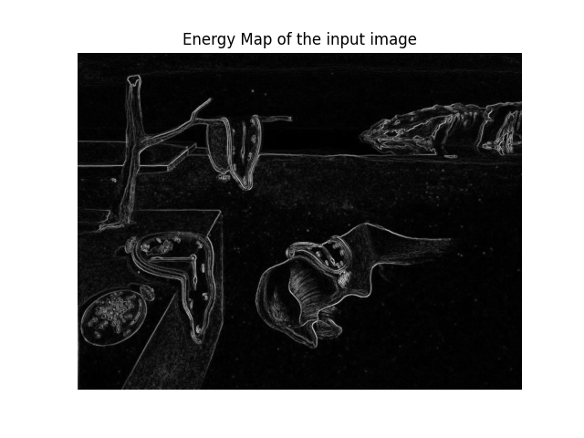

<p align = "center"><b><ins> Seam Carving </ins></b></p>

- In the paper [Seam Carving for Content-Aware Image Resizing](http://graphics.cs.cmu.edu/courses/15-463/2007_fall/hw/proj2/imret.pdf), the authors propose a "seam-carving" operation that supports image resizing for both reduction and expansion.
- A seam is an optimal 8-connected path of pixels on a single image from left to right or left to right, where optimality is defined by an image enery function.

<br>

---

<br>

<b><ins> Usage </ins></b>

```python main.py --path ./assets/persistence_of_memory.jpg```

<br>

---

<br>

<b><ins> Energy Function </ins></b>

- Intuitively, the goal should be to remove the unnoticable pixels that blend with their surroundings.
- For this, a simple energy function shown below was used:

$$
e_{1} = | \frac{\partial}{\partial x}I | + | \frac{\partial}{\partial y}I |
$$

<br>



<br>

- An optimal strategy to preserve energy, i.e. retain pixels with the highest value, would be to remove the pixels with the lowest energy in an ascending order.

<br>

- This basically means that for each pixel in each channel of the image, the sum of the absolute values of the partial derivatives in the x and y direction is the energy value for that pixel.
- The partial derivative used here is a [Sobel operation](https://en.wikipedia.org/wiki/Image_derivative).

<br>

$$
p'_{u} = 
\begin{bmatrix}
    1 & 2 & 1\\
    0 & 0 & 0\\
    -1 & -2 & -1\\
\end{bmatrix} * G
$$

and

$$
p'_{v} = 
\begin{bmatrix}
    1 & 0 & -1\\
    2 & 0 & -2\\
    1 & 0 & -1\\
\end{bmatrix} * G
$$


<br>

- We start by finding a path from the top of the image to the bottom of the image with the least energy by:

$$
M(i, j) = e(i, j) + min(M(i - 1, j - 1), \ M(i - 1, j), \ M(i - 1, j + 1))
$$

- Next, we can delete the seam with the lowest energy.
- This is repeated for every column

<br>


<br>

---

<br>

References:

- http://graphics.cs.cmu.edu/courses/15-463/2007_fall/hw/proj2/imret.pdf
- https://www.youtube.com/watch?v=rpB6zQNsbQU&list=PLZHQObOWTQDMp_VZelDYjka8tnXNpXhzJ&index=2
- https://karthikkaranth.me/blog/implementing-seam-carving-with-python/
- https://en.wikipedia.org/wiki/Image_derivative
