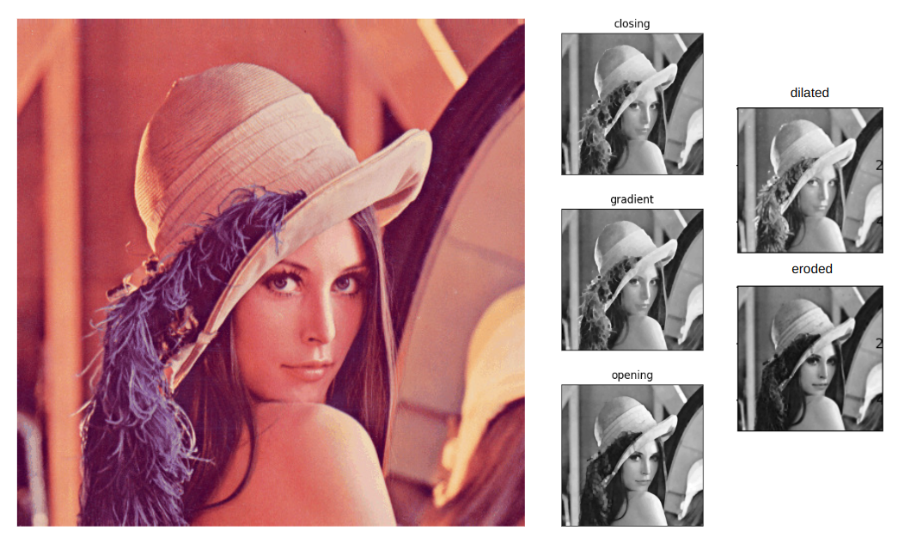

<b><ins> Image Processing Projects </ins></b>

1. [Image Manipulation](https://github.com/rohan1198/Image-Processing-Projects/tree/main/01_image_manipulation)
    - Scaling
    - Rotation
    - Translation
    - Cropping

 

    
Output

        

 

---

 

2. [Colour Quantization](https://github.com/rohan1198/Image-Processing-Projects/tree/main/02_colour_quantization)
    - Image Quantization
    - Video Quantization

 

    
Output

        

 

---

 

3. [Morphological Operations](https://github.com/rohan1198/Image-Processing-Projects/tree/main/03_morphological_operations)
    - Erosion
    - Dilation
    - Opening
    - Closing
    - Gradient

 

    
Output

        

 

---

 

4. [Image Blurring](https://github.com/rohan1198/Image-Processing-Projects/tree/main/04_image_blurring)
    - Average Blurring
    - Gaussian Blurring
    - Median Blurring
    - Bilateral Blurring

 

    
Output

        

 

---

 

5. [Edge Detection](https://github.com/rohan1198/Image-Processing-Projects/tree/main/05_edge_detection)
    - Manual Canny Edge Detection
    - Automatic Cany Edge Detection

 

    
Output

        

 

---

 

6. [Histogram Equalization](https://github.com/rohan1198/Image-Processing-Projects/tree/main/06_histogram_equalization)
    - Simple Histogram Equalization
    - Adaptive Histogram Equalization

    
Output

        

 

---

 

7. [Convolution](https://github.com/rohan1198/Image-Processing-Projects/tree/main/07_convolution)
    - Identity
    - 3x3 Gaussian Blur
    - 5x5 Gaussian Blur
    - Sharpen
    - Outline
    - Unsharp

    
Output

        

 

---

 

8. [Camera Calibration](https://github.com/rohan1198/Image-Processing-Projects/tree/main/08_camera_calibration)

    
Output

        

 

---

 

9. [Seam Carving](https://github.com/rohan1198/Image-Processing-Projects/tree/main/09_seam_carving)
    

    
Output

        

 

---

  

References:

Szeliski, R. (2022), 'Computer vision algorithms and applications' , Springer , London; New York  
Adrian Rosebrock, PyImageSearch, https://pyimagesearch.com
